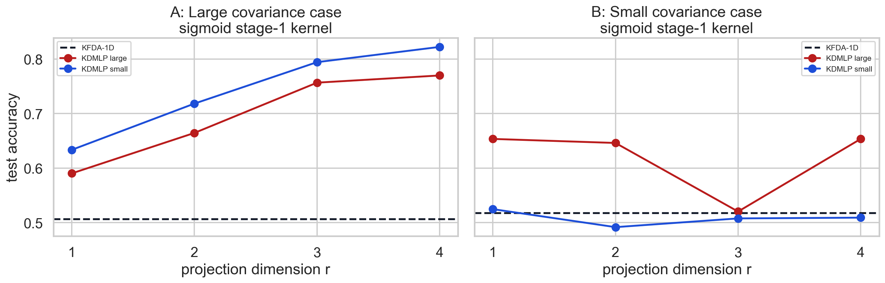
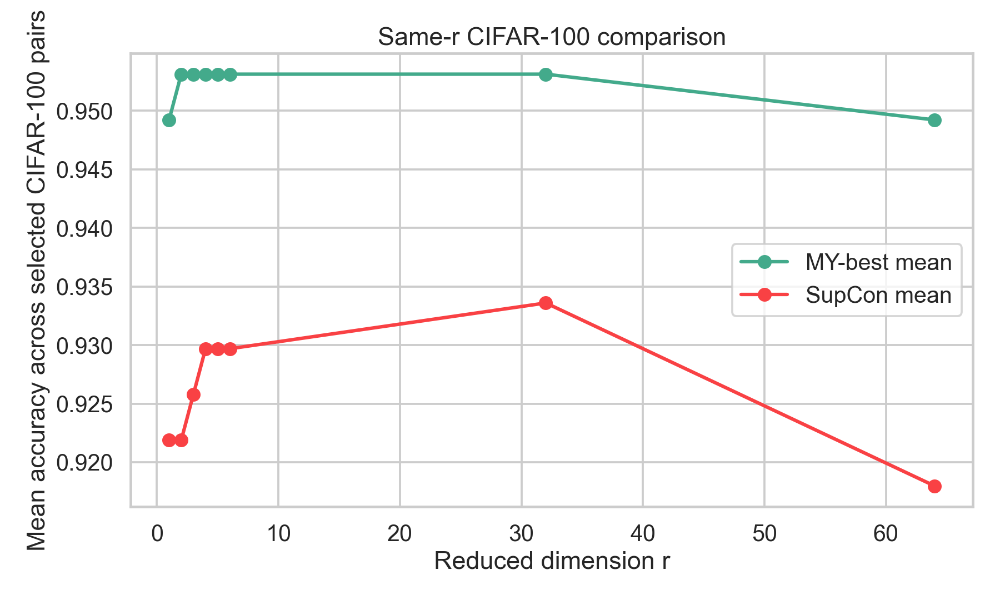
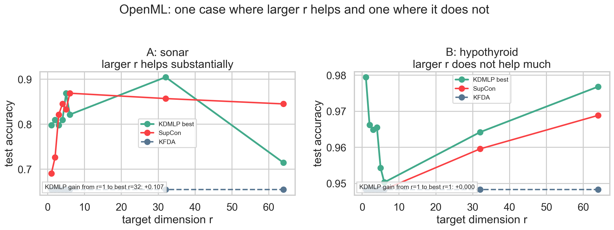
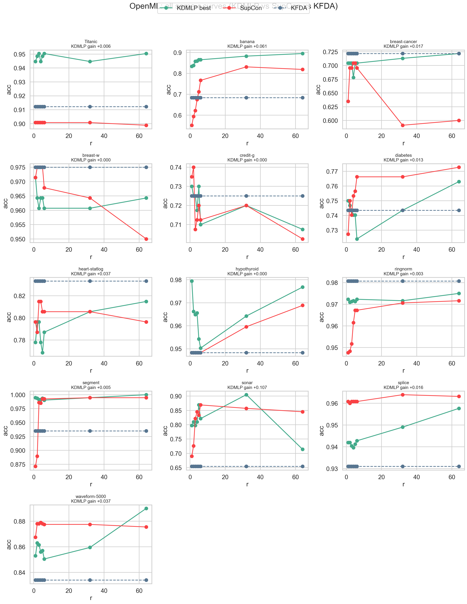
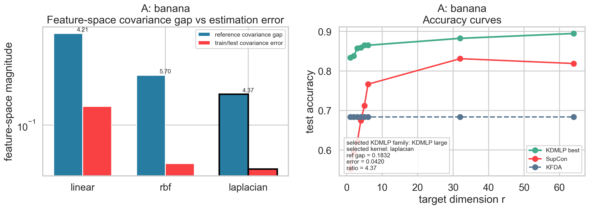
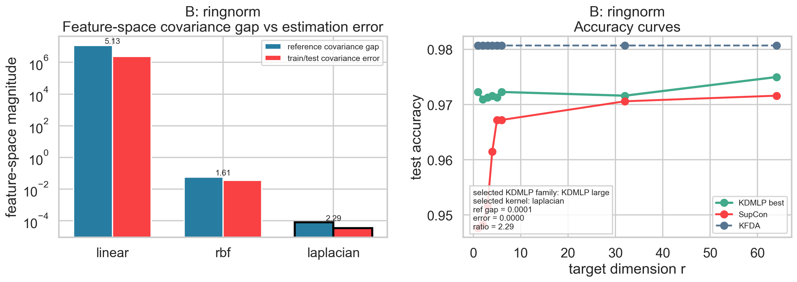
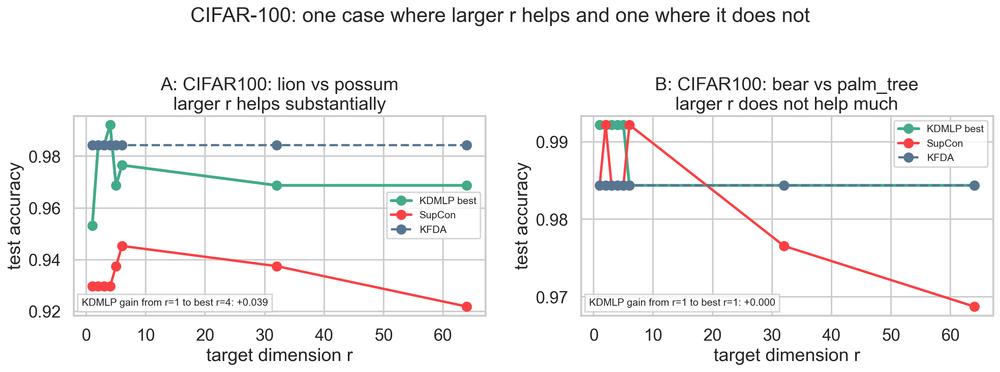

# ICML_-Rebuttal

This repository collects the new simulation and comparison code used for the ICML rebuttal experiments.

## Included Workspaces

- `simulations/redo_projection_workspace`
  Gaussian KDMLP vs KFDA experiments, including the higher-dimensional `d=220` audit.
- `simulations/kernel_space_signal_noise_workspace`
  Feature-space covariance-signal vs estimation-noise experiments.
- `simulations/supcon_gaussian_workspace`
  Gaussian KDMLP vs supervised contrastive learning comparisons.
- `simulations/supcon_openml_workspace`
  OpenML KDMLP vs supervised contrastive learning comparisons.
- `simulations/supcon_cifar100_workspace`
  CIFAR-100 binary-pair KDMLP vs supervised contrastive learning scans and same-`r` comparisons.
- `simulations/real_data_r_growth_workspace`
  Focused real-data examples showing one case where increasing `r` helps and one where it does not.

Each workspace keeps its own scripts, README, tables, and generated plots.

## 1. Large Gaussian KDMLP vs KFDA

Workspace: `simulations/redo_projection_workspace`

This set of experiments studies three large Gaussian regimes: same mean with different covariance, different mean with different covariance, and different mean with only a small covariance gap. The main figure below shows the higher-dimensional follow-up with `p=500` and a denser grid up to `r=32`; underneath it we keep a moderate-dimensional sanity baseline at `p=120`. In both settings, covariance-rich regimes benefit from larger `r`, while the small-gap regime behaves differently and should be interpreted together with the mean-separation term in `KDMLP large`.

| Label | Regime (`p=500`) | KFDA-1D | Best KDMLP | Best KDMLP acc. |
| --- | --- | ---: | --- | ---: |
| A | Same mean, different covariance | 0.523 | `KDMLP large`, `r=32` | 0.697 |
| B | Different mean, different covariance | 0.646 | `KDMLP large`, `r=32` | 0.686 |
| C | Different mean, small covariance gap | 0.663 | `KDMLP large`, `r=1` | 0.677 |

The smoother `p=500` grid is
`{1,2,3,4,5,6,7,8,10,12,14,16,20,24,28,32}`. This run shows a cleaner trend: the covariance-only case improves steadily as `r` grows, the mixed mean/covariance case gains more gradually, and the small-gap regime stays nearly flat and peaks at very small `r`.

The moderate-dimensional baseline sweep now uses `p=120`, `repeats=1`, with `r in {1,2,3,4,6,8,10,12,16,24,32}` and gives:

| Label | Regime (`p=120`) | KFDA-1D | Best KDMLP | Best KDMLP acc. |
| --- | --- | ---: | --- | ---: |
| A | Same mean, different covariance | 0.648 | `KDMLP large`, `r=32` | 0.784 |
| B | Different mean, different covariance | 0.680 | `KDMLP small`, `r=24` | 0.715 |
| C | Different mean, small covariance gap | 0.518 | `KDMLP large`, `r=2` | 0.624 |

Here `p` is the original input dimension of the Gaussian data and `r` is the target KDMLP projection dimension. To keep the interpretation as true dimension reduction, the Gaussian workspace now enforces `r <= p` for every stage-1 kernel. The default command uses the moderate `p=120` setup above, while the `p=500` run remains the cleaner large-dimensional presentation.

### Running time

We also record wall-clock timing for the moderate `p=120` Gaussian baseline in `simulations/redo_projection_workspace/outputs/timing_summary.csv`. In exact kernel form, `KFDA-1D` is still often faster, while KDMLP trades extra wall-clock time for better accuracy in the covariance-rich regimes and for a stronger low-`r` gain in the small-gap regime.

| Label | Regime (`p=120`) | KFDA-1D time (s) | Fastest KDMLP time (s) | Best-accuracy KDMLP acc. / time |
| --- | --- | ---: | ---: | --- |
| A | Same mean, different covariance | 1.03 | 0.76 | 0.784 at 1.34s |
| B | Different mean, different covariance | 0.46 | 0.60 | 0.715 at 1.02s |
| C | Different mean, small covariance gap | 0.38 | 0.40 | 0.624 at 0.41s |

This timing pattern matches the corrected statistical story in the plots: KDMLP still pays a higher stage-1 cost because it searches over covariance-sensitive projections, but the extra computation is most justified in the covariance-rich regimes. In the moderate `p=120` weak-gap case, the best setting stays at very small `r`, which is consistent with a regime where large covariance-sensitive expansions are not especially helpful.

## 2. Feature-Space Signal vs Estimation Noise

Workspace: `simulations/kernel_space_signal_noise_workspace`

This workspace is a diagnostic companion to the Gaussian experiments, now using the full stage-1 kernel menu again. KDMLP is designed to use class-separation information carried by the difference between class covariance matrices, whereas KFDA primarily follows the mean-separation direction. The practical issue is that with finite training data, the covariance difference that KDMLP sees is always a mixture of true covariance signal and covariance-estimation error. Therefore, the most meaningful comparison is whether the true feature-space covariance difference is larger than its estimation error. In the tables below, each case is summarized by the stage-1 kernel that gives the strongest feature-space covariance signal/error ratio.

| Label | Case | Best feature signal / error | KFDA-1D | Best KDMLP |
| --- | ---: | ---: | ---: |
| A | Large covariance case (`d=220`) | 4.199 | 0.874 | 0.918 |
| B | Small covariance case (`d=220`) | 0.447 | 0.648 | 0.683 |

The plots below now show the selected-kernel comparison again at the default `d=220`. In Case A, the representative nonlinear kernel is `sigmoid`, and its feature-space covariance difference is much larger than the estimation error (`0.2135` vs `0.0509`, ratio `4.199`), so KDMLP has a genuinely stable covariance signal to use and improves over KFDA (`0.918` vs `0.874`). In Case B, even the best representative kernel (`sigmoid` again) stays below the noise floor (`0.0290` vs `0.0649`, ratio `0.447`), so the covariance part is not reliable on its own; there the best KDMLP result (`0.683` vs `0.648` for KFDA) should be read as a joint mean/covariance effect rather than as a pure covariance win. The higher-dimensional `d=500` run is still kept in the workspace as a supplementary check.

| Label | Stage-1 kernel | True feature covariance difference | Feature covariance error | Relation |
| --- | --- | ---: | ---: | --- |
| A | sigmoid | 0.2135 | 0.0509 | signal > error |
| B | sigmoid | 0.0290 | 0.0649 | signal < error |

This case-level table makes the intended separation explicit at the feature-space level: in Case A, the representative kernel has a true covariance difference larger than the estimation error, whereas in Case B it does not.

The corresponding accuracy curves now use the representative nonlinear kernel from the feature-space table (`sigmoid` in both cases). Under that nonlinear stage-1 kernel, the large-covariance case still shows a stable covariance signal and KDMLP improves over KFDA, while in the small-covariance case the behavior remains much less robust and should be interpreted together with the covariance-error diagnostic above.

## 3. Gaussian KDMLP vs SupCon

Workspace: `simulations/supcon_gaussian_workspace`

This comparison uses the dimension-matched protocol: after SupCon training, its representation is compressed to the same final dimension `r` as KDMLP. In this high-dimensional synthetic setting, `KDMLP large` stays near-perfect at very small `r`, while SupCon benefits only modestly from increasing `r`.

| Label | Final dimension `r` | `KDMLP large` | SupCon |
| --- | ---: | ---: | ---: |
| A | 1 | 0.9992 | 0.9471 |
| B | 4 | 0.9992 | 0.9469 |
| C | 6 | 0.9990 | 0.9492 |

## 4. OpenML KDMLP vs SupCon (+ KFDA)

Workspace: `simulations/supcon_openml_workspace`

This workspace extends the same-`r` comparison to OpenML binary classification tasks. The strongest wins appear on datasets where a small number of KDMLP directions remains highly informative, while some datasets remain more sensitive to the chosen `r`. The updated same-`r` plots now include the binary KFDA reference across the tested `r` grid as well, repeated as a flat curve because binary KFDA contributes only one non-zero discriminant direction.

| Label | Dataset | `r` | Best KDMLP | SupCon | KFDA |
| --- | --- | ---: | ---: | ---: | ---: |
| A | breast-cancer | 64 | 0.722 | 0.600 | 0.722 |
| B | Titanic | 3 | 0.950 | 0.901 | 0.912 |
| C | hypothyroid | 1 | 0.979 | 0.948 | 0.948 |
| D | sonar | 32 | 0.905 | 0.857 | 0.655 |

## 5. CIFAR-100 KDMLP vs SupCon (+ KFDA)

Workspace: `simulations/supcon_cifar100_workspace`

These experiments compare a selected set of binary CIFAR-100 tasks, using the same final dimension `r` for all three methods in the summary plots. The most useful pairs show that `KDMLP large` can outperform SupCon while still using a small or moderate target dimension, and the KFDA reference is now shown on the same `r` axis as a flat binary baseline.

| Label | Task | Best `r` | Best KDMLP | SupCon | KFDA |
| --- | --- | ---: | ---: | ---: | ---: |
| A | beaver vs possum | 2 | 0.906 | 0.844 | 0.836 |
| B | clock vs tractor | 1 | 1.000 | 1.000 | 1.000 |

## 6. Real-Data Gains As `r` Increases

Workspace: `simulations/real_data_r_growth_workspace`

This reviewer-focused workspace isolates the main real-data question: when does increasing the KDMLP target dimension `r` materially help, and when does it not? For each domain we show one example with a clear gain from larger `r` and one example where the KDMLP curve is essentially flat. In all panels, KFDA is the flat binary reference and SupCon is shown on the same `r` grid for the same dataset.

| Label | Domain | Task | `r=1` KDMLP | Best `r` | Best KDMLP | SupCon best | KFDA |
| --- | --- | --- | ---: | ---: | ---: | ---: | ---: |
| A | OpenML | sonar | 0.798 | 32 | 0.905 | 0.869 | 0.655 |
| B | OpenML | hypothyroid | 0.979 | 1 | 0.979 | 0.969 | 0.948 |
| C | CIFAR-100 | lion vs possum | 0.953 | 4 | 0.992 | 0.945 | 0.984 |
| D | CIFAR-100 | bear vs palm_tree | 0.992 | 1 | 0.992 | 0.992 | 0.984 |

For OpenML, `sonar` is the clean positive example: KDMLP rises by about `+0.107` from `r=1` to its best point at `r=32`. By contrast, `hypothyroid` is essentially flat, so increasing `r` does not buy anything there. For CIFAR-100, `lion vs possum` shows the same positive pattern, while `bear vs palm_tree` is already near its ceiling at `r=1` and stays flat.

The workspace also exports every OpenML dataset individually. The grid below summarizes all 13 same-`r` OpenML curves, and the folder `simulations/real_data_r_growth_workspace/outputs/openml_all_cases/` contains one plot per dataset.

| Label | Dataset | Selected KDMLP kernel | Reference covariance gap | Best KDMLP | SupCon best | KFDA |
| --- | --- | --- | ---: | ---: | ---: | ---: |
| A | banana | `laplacian` | 0.1832 | 0.895 | 0.831 | 0.683 |
| B | ringnorm | `laplacian` | 0.000079 | 0.975 | 0.972 | 0.981 |

