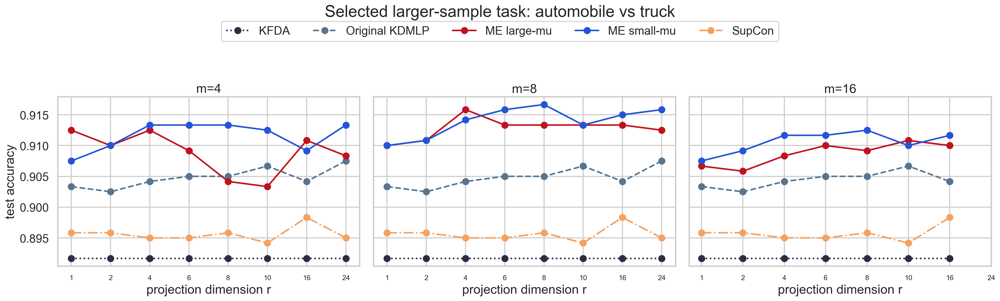
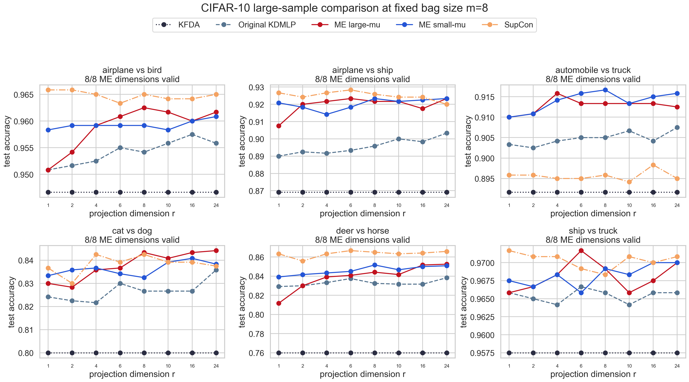
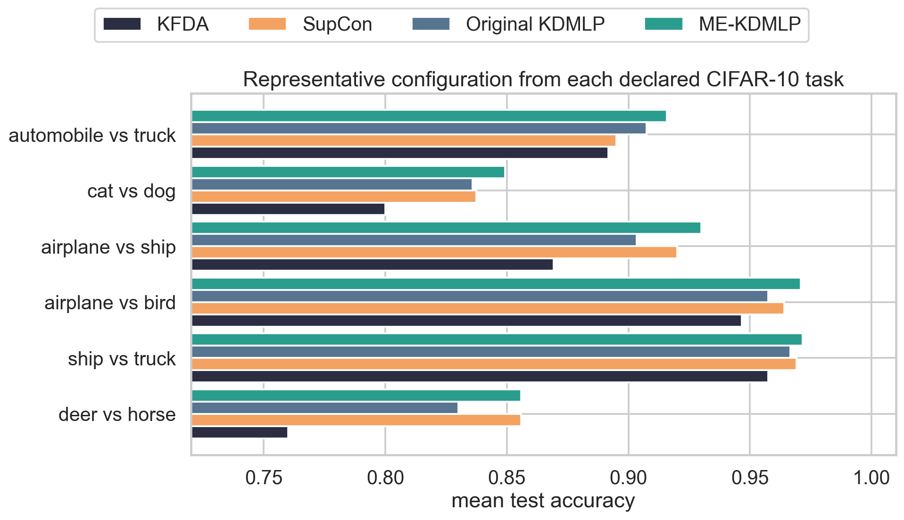

# CIFAR-10 Large-Sample ME-KDMLP Comparison

This workspace compares original KDMLP, the new large-mean and small-mean
ME-KDMLP constructions, binary KFDA, and feature-level SupCon on a fixed set of
six CIFAR-10 binary tasks. The complete experimental results are generated by
`run_cifar10_large_sample.py`.

The experiment reuses the frozen ImageNet-pretrained ResNet-18 feature caches
from the earlier CIFAR-10 code. Each task has 500 observations per class in a
512-dimensional feature space. Every repeated stratified 60/40 split therefore
contains 300 training and 200 held-out test observations per class.

ME-KDMLP uses disjoint same-label training bags only to learn Stage 1. The
Stage-2 linear probe is trained and evaluated on the original single points,
not on bag means. Results are reported for `m in {4,8,16}` and
`r in {1,2,4,6,8,10,16,24}`. Original KDMLP and KFDA retain the historical
80-anchor-per-class cap. SupCon uses the historical 128-dimensional feature
encoder and 64-dimensional contrastive head; training-set PCA reduces its
encoder representation to the same final `r` used by KDMLP.

The six candidate pairs are declared in the script before evaluation. All
candidate results are retained in `outputs/cifar10_large_sample_compact.csv`.
The representative row for each pair is descriptive: it prioritizes a setting
where ME-KDMLP is no more than 0.02 accuracy below original KDMLP and exceeds
both KFDA and SupCon. An ME-KDMLP improvement over original KDMLP also satisfies
this retention criterion. It is not a nested test-set model-selection rule.

Run the complete experiment with:

```bash
python run_cifar10_large_sample.py
```

The default run resumes complete pair/split blocks from the checkpoint CSVs.
Pass `--no-resume` to recompute every requested block from scratch.

## Results

The table reports one descriptive representative configuration per declared
pair, averaged over the same three splits. A row qualifies when ME-KDMLP is no
more than 0.02 below original KDMLP and is strictly better than both KFDA and
same-`r` SupCon.

| CIFAR-10 task | `m` | `r` | ME regime | ME-KDMLP | Original KDMLP | KFDA | SupCon | Qualifies |
| --- | ---: | ---: | --- | ---: | ---: | ---: | ---: | :---: |
| airplane vs bird | 4 | 16 | large-mean | **0.9708** | 0.9575 | 0.9467 | 0.9642 | yes |
| airplane vs ship | 4 | 24 | large-mean | **0.9300** | 0.9033 | 0.8692 | 0.9200 | yes |
| automobile vs truck | 8 | 24 | small-mean | **0.9158** | 0.9075 | 0.8917 | 0.8950 | yes |
| cat vs dog | 4 | 24 | large-mean | **0.8492** | 0.8358 | 0.8000 | 0.8375 | yes |
| deer vs horse | 4 | 2 | small-mean | 0.8558 | 0.8300 | 0.7600 | **0.8558** | no (tie) |
| ship vs truck | 4 | 6 | small-mean | **0.9717** | 0.9667 | 0.9575 | 0.9692 | yes |

Thus, five of the six fixed candidate tasks contain a tested configuration
that satisfies the stated criterion. `automobile vs truck` is the clearest
balanced example: at `m=8` and `r=24`, small-mean ME-KDMLP reaches 0.9158,
compared with 0.9075 for original KDMLP, 0.8917 for KFDA, and 0.8950 for
same-`r` SupCon.

A secondary check uses the same preselected task and fixed `m=8,r=24` on the
separately cached data sample with seed 11. Best ME-KDMLP reaches 0.9433,
compared with 0.9383 for original KDMLP, 0.9275 for KFDA, and 0.9408 for
SupCon. This check is saved in `outputs_confirmation_seed11/`. It supports the
qualitative conclusion but does not replace nested model selection because the
reported ME family/kernel is still a descriptive best-of-grid summary.

```bash
python run_cifar10_large_sample.py \
  --pairs automobile:truck \
  --r-values 24 \
  --m-values 8 \
  --repeats 3 \
  --data-seed 11 \
  --seed 11 \
  --output-dir outputs_confirmation_seed11
```



The six-panel plot retains the complete curves at fixed `m=8`, including
tasks and dimensions where ME-KDMLP does not win.





## Why Sample Size Helps

The earlier CIFAR-100 run had only 48 training observations per class. At
`m=8`, this produced six disjoint bags per class and supported only low target
dimensions. Here every split has 300 training observations per class:

| Bag size `m` | Bags per class | Largest requested large-mean `r` | Largest requested small-mean `r` |
| ---: | ---: | ---: | ---: |
| 4 | 75 | 24 | 24 |
| 8 | 37 | 24 | 24 |
| 16 | 18 | 16 | 16 |

The final row stops at `r=16` because `r=24` exceeds the finite-bag covariance
rank. This is a sample-size limitation, not a limitation of the original
512-dimensional ResNet feature vectors.

## Main Outputs

- `outputs/cifar10_large_sample_compact.csv`: all valid pair/`m`/`r` mean results
- `outputs/pair_representatives.csv`: one descriptive row per declared pair
- `outputs/me_candidates.csv`: all kernels, regimes, statuses, and splits
- `outputs/rank_support.csv`: finite-bag rank support
- `outputs/cifar10_all_pairs_fixed_m4.png`
- `outputs/cifar10_all_pairs_fixed_m8.png`
- `outputs/cifar10_all_pairs_fixed_m16.png`
- `outputs/selected_pair_all_m.png`
- `outputs/screening_summary.png`

Use a quick smoke run with:

```bash
python run_cifar10_large_sample.py \
  --pairs airplane:ship \
  --r-values 1,2,4 \
  --m-values 8 \
  --repeats 1 \
  --supcon-epochs 2 \
  --kernels quick \
  --output-dir outputs_smoke
```
