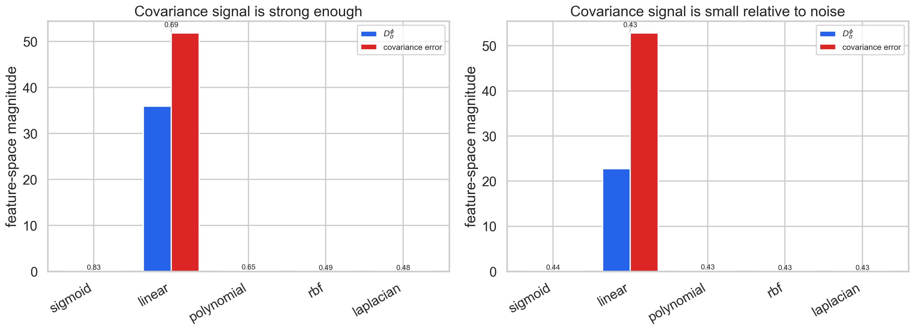
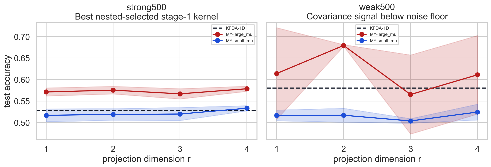

# Feature-Space Signal/Noise Workspace

This folder isolates two different covariance-signal situations. The default run is at dimension `220`, and a higher-dimensional supplementary run is provided at `d=500` with `repeats=3`.

- a strong feature-space covariance-signal case where KDMLP can beat KFDA
- a weak feature-space covariance-signal case where covariance estimation noise is larger than the true gap

## Main script

- `kernel_space_signal_noise_demo.py`

Run it with:

```bash
python kernel_space_signal_noise_demo.py
```

Example higher-dimensional run:

```bash
python kernel_space_signal_noise_demo.py --dimension 500 --repeats 3 --output-subdir outputs_d500_r3
```

## Main outputs

- `outputs/strong_bestkernel_accuracy_summary.csv`
- `outputs/weak_bestkernel_accuracy_summary.csv`
- `outputs/feature_space_signal_noise_summary.csv`
- `outputs/accuracy_curves.png`
- `outputs/feature_space_signal_vs_noise.png`
- `outputs/projection_views.png`
- `outputs_d500_r3/`

The figures below use the higher-dimensional supplementary run in `outputs_d500_r3`.





## Interpretation

- The original pair of cases is built at `d=220`, and the displayed supplementary figures use `d=500` with `repeats=3`.
- The strong case is a high-dimensional same-mean / different-covariance regime.
- The weak case is a high-dimensional mean-gap / small-covariance-gap regime.
- The comparison is driven by the feature-space diagnostics:
  `ref_D_sigma_feature` versus `cov_gap_error_feature`.
- In the strong case, the best feature-space signal-to-error ratio exceeds `1`, and KDMLP improves over KFDA.
- In the weak case, the covariance part is below the noise floor; the final accuracy can still be influenced by the mean-separation part of the method.
- The companion Gaussian sweep in `simulations/redo_projection_workspace` now enforces `r <= p` for every stage-1 kernel. In that corrected baseline, the same `diff_mean_tiny_covariance_gap` regime is still much less decisive than the covariance-rich cases: `KFDA-1D = 0.6007`, while the best KDMLP accuracy only reaches `0.6015` at `r=16`.
- The higher-dimensional supplementary run is included in `outputs_d500_r3`, where `d=500` and `repeats=3`. In that run, the strong case again favors KDMLP (`0.579` vs `0.529` for KFDA), while the weak case still has feature-space signal below covariance error but is helped by the mean-separation component of `KDMLP large`.
