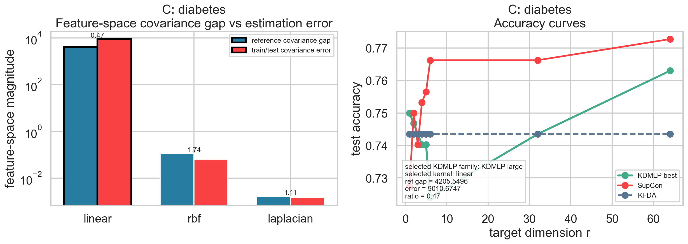

# Real-Data r-Growth Examples

Main script:

- `real_data_r_growth_examples.py`
- `openml_feature_covariance_cases.py`

Outputs:

- `outputs/selected_cases_summary.csv`
- `outputs/openml_selected_curves.csv`
- `outputs/openml_all_cases_summary.csv`
- `outputs/openml_all_cases_grid.png`
- `outputs/openml_all_cases/*.png`
- `outputs/openml_feature_covariance_cases/openml_feature_covariance_summary.csv`
- `outputs/openml_feature_covariance_cases/*_feature_covariance_case.png`
- `outputs/cifar100_selected_curves.csv`
- `outputs/openml_r_growth_examples.png`
- `outputs/cifar100_r_growth_examples.png`

This workspace answers a focused reviewer question using saved real-data results from the OpenML and CIFAR-100 comparisons. It shows one case where increasing the KDMLP target dimension `r` helps substantially and one case where it does not, while keeping the same SupCon curve and the flat binary KFDA reference on the same plot.

| Label | Domain | Task | `r=1` KDMLP | Best `r` | Best KDMLP | SupCon best | KFDA |
| --- | --- | --- | ---: | ---: | ---: | ---: | ---: |
| A | OpenML | sonar | 0.798 | 32 | 0.905 | 0.869 | 0.655 |
| B | OpenML | hypothyroid | 0.979 | 1 | 0.979 | 0.969 | 0.948 |
| C | CIFAR-100 | lion vs possum | 0.953 | 4 | 0.992 | 0.945 | 0.984 |
| D | CIFAR-100 | bear vs palm_tree | 0.992 | 1 | 0.992 | 0.992 | 0.984 |

The workspace now also exports all OpenML datasets one by one. Each dataset gets its own curve in `outputs/openml_all_cases/`, and the grid below gives a quick overview of all 13 tasks.

We also added a more focused feature-space covariance diagnostic for three OpenML datasets. For each dataset, we take the KDMLP family/kernel selected at the best KDMLP point, compute a held-out reference feature-space covariance gap, and compare it with the train/test covariance-gap estimation discrepancy. `banana` is the clean positive example: under the selected `laplacian` kernel the held-out covariance signal is much larger than the estimation error (`0.1832` vs `0.0420`, ratio `4.37`), and KDMLP clearly improves over KFDA (`0.895` vs `0.683`). `ringnorm` is more subtle: the selected `laplacian` kernel still has a measurable covariance signal (`7.9e-05` vs `3.5e-05`, ratio `2.29`), but KFDA remains slightly stronger (`0.981` vs `0.975`), so the presence of covariance signal alone is not sufficient when the KFDA direction is already extremely strong. `diabetes` is the noise-dominated example under the selected `linear` kernel (`4205.5` vs `9010.7`, ratio `0.47`), and KDMLP only shows a marginal gain at the largest `r` rather than a robust advantage over KFDA.

| Label | Dataset | Selected KDMLP kernel | Reference covariance gap | Train/test covariance error | Ratio | Best KDMLP | SupCon best | KFDA |
| --- | --- | --- | ---: | ---: | ---: | ---: | ---: | ---: |
| A | banana | `laplacian` | 0.1832 | 0.0420 | 4.37 | 0.895 | 0.831 | 0.683 |
| B | ringnorm | `laplacian` | 0.000079 | 0.000035 | 2.29 | 0.975 | 0.972 | 0.981 |
| C | diabetes | `linear` | 4205.5 | 9010.7 | 0.47 | 0.763 | 0.773 | 0.744 |

