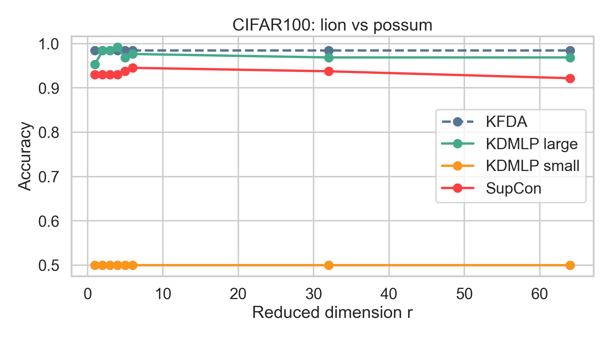
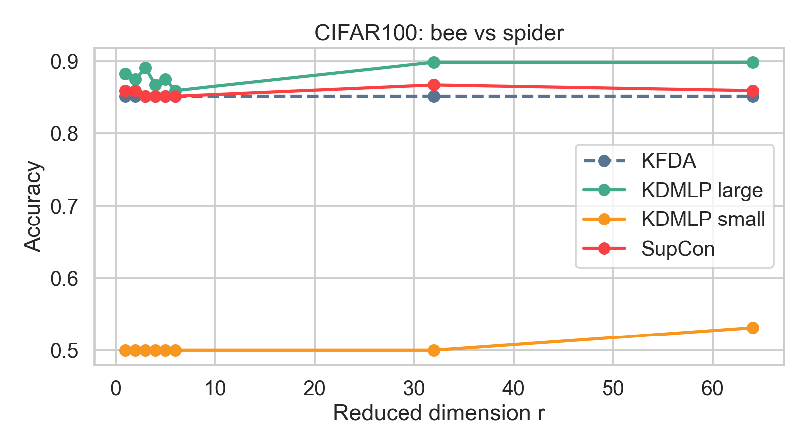
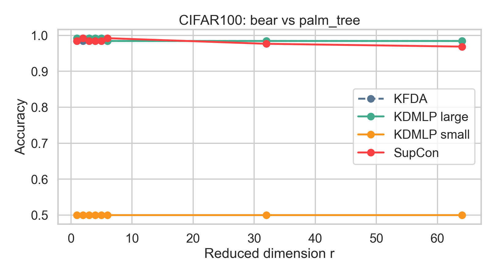
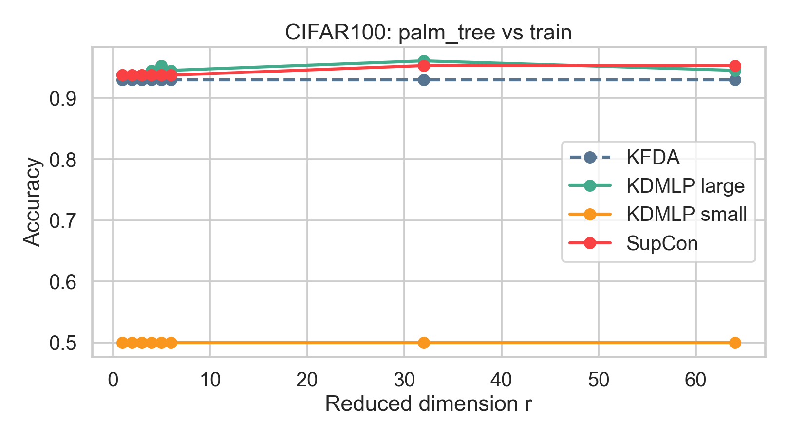

# CIFAR-100 KDMLP vs SupCon

Main script:

- `cifar100_scan_supcon_vs_ours.py`
- `cifar100_same_r_supcon_vs_ours.py`
- `cifar100_more_examples_search.py`

Outputs:

- `outputs/cifar100_pair_scan.csv`
- `outputs/cifar100_full_check.csv`
- `outputs/cifar100_margin_plot.png`
- best-pair plots such as `outputs/beaver_vs_possum_accuracy_bar.png`
- `outputs_same_r/cifar100_same_r_mean_curve.png`
- `outputs_same_r/beaver_vs_possum_same_r_summary.csv`
- `outputs_same_r/clock_vs_tractor_same_r_summary.csv`

This workspace compares selected CIFAR-100 binary pairs using a common frozen ImageNet-pretrained ResNet-18 representation. KDMLP operates on the resulting 512-dimensional feature vectors, while the feature-level SupCon baseline trains an additional contrastive encoder on the same training vectors. Training-set PCA reduces the SupCon encoder output to the same final dimension `r` used by KDMLP. KFDA is shown across the tested `r` grid as a flat 1D binary reference.

The detailed shortlist contains four exploratory examples evaluated at `r in {1,2,3,4,5,6,32,64}` over two stratified splits:

| Label | Task | Reported `r` | KDMLP | SupCon | KFDA |
| --- | --- | ---: | ---: | ---: | ---: |
| A | lion vs possum | 4 | 0.992 | 0.930 | 0.984 |
| B | bee vs spider | 64 | 0.898 | 0.859 | 0.852 |
| C | bear vs palm tree | 64 | 0.984 | 0.969 | 0.984 |
| D | palm tree vs train | 5 | 0.953 | 0.938 | 0.930 |

The reported dimension maximizes the observed KDMLP-minus-SupCon margin and is therefore descriptive rather than validation-selected.

