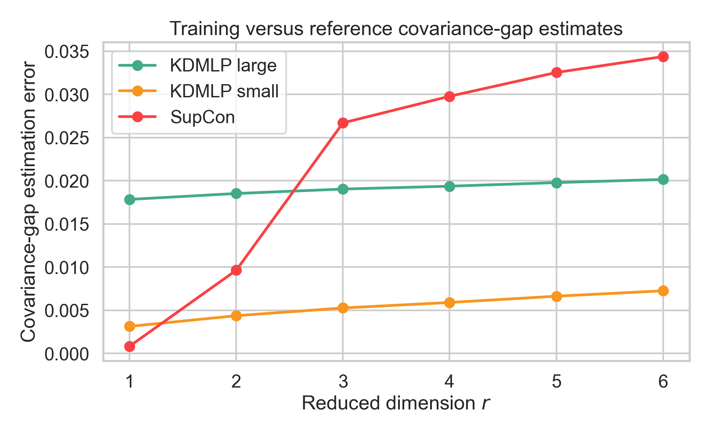
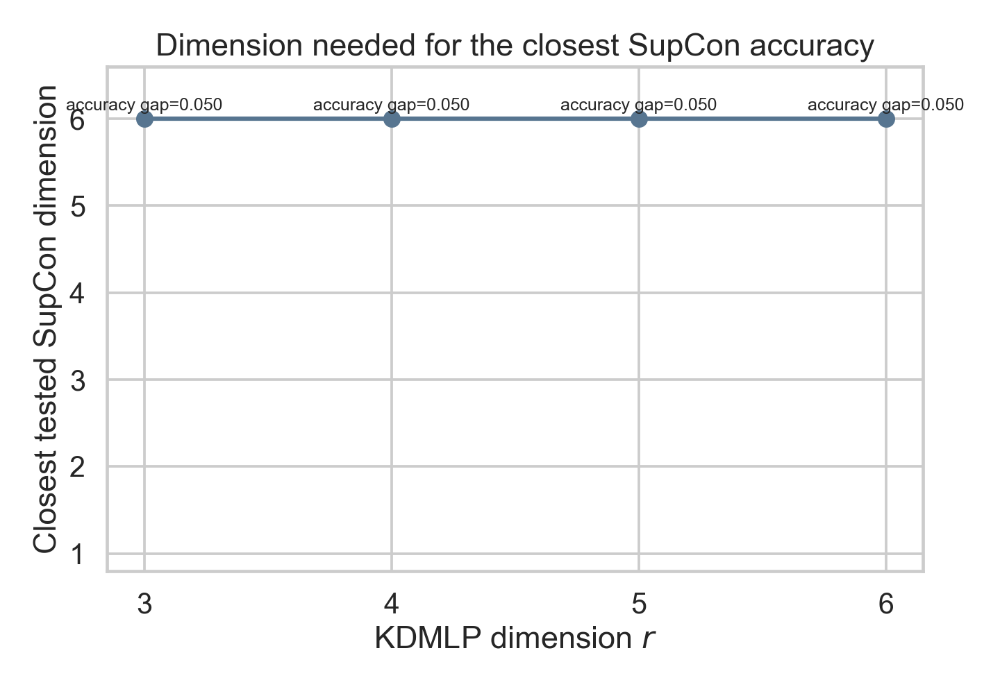

# Gaussian KDMLP vs SupCon

The primary same-dimension experiment is implemented in
`gaussian_same_r_dimmatch.py`; its saved results are in `outputs_dimmatch/`.
The older `gaussian_supcon_vs_ours.py` and `gaussian_supcon_vs_ours_hd220.py`
experiments are retained as supplementary checks.

## Setup

The two classes are Gaussian in `d=220` dimensions. For a random unit vector
`v` and independent Gaussian matrices `A_0,A_1`, the population parameters are

```text
mu_0 = -0.1 v,                 Sigma_0 = A_0^T A_0 / d,
mu_1 =  0.1 v,                 Sigma_1 = 2.5 A_1^T A_1 / d.
```

Thus, the population mean gap is `0.2`, whereas the input-space covariance gap
is `||Sigma_1-Sigma_0||_F = 45.538`. Each of two repetitions uses 320 training
samples, 1,200 test samples, and 2,400 independent reference samples per class.
KDMLP and SupCon are compared at the same final dimensions `r=1,...,6`.

SupCon trains a feature-level MLP with a 128-dimensional encoder and a
64-dimensional projection head. Training-set PCA then reduces the encoder output
to the requested final dimension `r`. The same logistic-probe procedure is used
to evaluate the KDMLP and SupCon representations in this workspace.

## Results

| `r` | KDMLP large | KDMLP small | SupCon |
| ---: | ---: | ---: | ---: |
| 1 | 0.9992 | 0.5752 | 0.9471 |
| 2 | 0.9992 | 0.5967 | 0.9479 |
| 3 | 0.9992 | 0.6121 | 0.9475 |
| 4 | 0.9992 | 0.6375 | 0.9469 |
| 5 | 0.9990 | 0.6365 | 0.9483 |
| 6 | 0.9990 | 0.6406 | 0.9492 |


For a learned representation `Z`, the covariance-gap estimation error is

```text
||(C_1,tr-C_0,tr) - (C_1,ref-C_0,ref)||_F.
```

The reference covariances use the independent reference sample transformed by
the representation learned from the training set. In a finite-dimensional
reduced space, this Frobenius norm equals the corresponding Hilbert--Schmidt
norm. Absolute errors should be compared across `r` within a method, not used to
rank different methods, because their learned coordinates have different scales.



Within the tested SupCon grid, no dimension matches the approximately 0.999
KDMLP-large accuracy: the closest SupCon result is at `r=6`, with a remaining
accuracy gap of about 0.050.



The current KDMLP curves select the best Stage-1 kernel at each `r` using test
accuracy. They should therefore be treated as an exploratory upper envelope; a
confirmatory benchmark should select the kernel by nested training validation.

## Main Outputs

- `outputs_dimmatch/case_meta.csv`
- `outputs_dimmatch/same_r_accuracy_summary.csv`
- `outputs_dimmatch/same_r_covariance_errors.csv`
- `outputs_dimmatch/supcon_matching_dimensions.csv`
- `outputs_dimmatch/same_r_accuracy_plot.png`
- `outputs_dimmatch/same_r_covgap_error_plot.png`
- `outputs_dimmatch/supcon_matching_dimension_plot.png`
