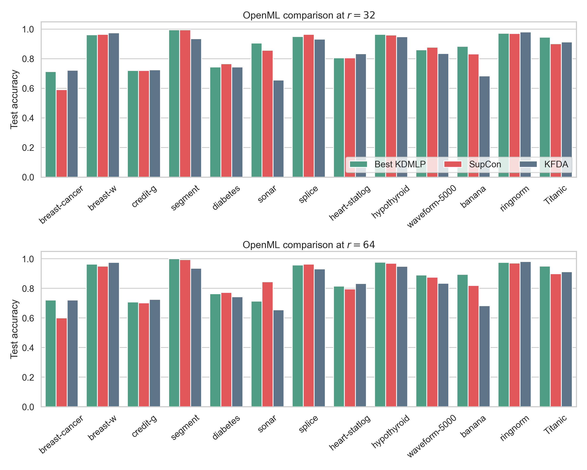
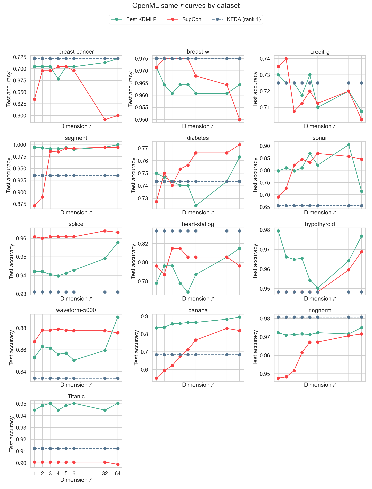

# OpenML KDMLP vs SupCon and KFDA

The same-dimension experiment is implemented in
`openml_supcon_vs_ours_same_r.py`, with saved results in `outputs_same_r/`.
It evaluates KDMLP, feature-level supervised contrastive learning (SupCon), and
binary KFDA on 13 OpenML datasets.

## Setup

The evaluated OpenML tasks are breast-cancer (13), breast-w (15), credit-g
(31), segment (36), diabetes (37), sonar (40), splice (46), heart-statlog (53),
hypothyroid (57), waveform-5000 (60), banana (1460), ringnorm (1496), and
Titanic (40945). Multiclass datasets are converted to one-versus-rest binary
tasks. Each dataset uses one stratified 60/40 train/test split and the common
dimension grid `r in {1,2,3,4,5,6,32,64}`.

KDMLP searches linear, RBF, and Laplacian Stage-1 kernels and its large- and
small-mean regimes. Its Stage-2 SVM is selected by two-fold training validation.
SupCon trains a feature-level MLP with a 128-dimensional encoder and a
64-dimensional contrastive head; training-set PCA produces each final dimension
`r`, followed by a cross-validated logistic probe. Binary KFDA has at most one
discriminant direction, so the same rank-1 KFDA result is repeated across `r` as
a reference.

## Aggregate Results

| `r` | Mean best KDMLP | Mean SupCon | Mean KFDA | KDMLP vs SupCon W/T/L | KDMLP vs KFDA W/T/L |
| ---: | ---: | ---: | ---: | ---: | ---: |
| 32 | 0.8780 | 0.8617 | 0.8368 | 6/3/4 | 7/1/5 |
| 64 | 0.8716 | 0.8583 | 0.8368 | 10/0/3 | 8/1/4 |

The average curve shows that KDMLP is strongest at `r=32` in this run. SupCon
improves substantially between `r=1` and `r=6`, but its mean remains below the
best KDMLP curve at every tested dimension except the near-tie at `r=6`.

The separate high-dimensional panels avoid averaging the `r=32` and `r=64`
results and make the dataset-level variation explicit.

The complete grid shows that increasing `r` is not uniformly beneficial. For
example, banana improves steadily for KDMLP and sonar peaks at `r=32`, whereas
hypothyroid is already strongest at `r=1` and ringnorm remains close to a
ceiling across the grid.

## Interpretation Limit

These outputs are an exploratory screening result, not a fully nested benchmark.
There is only one train/test split, the current loader fits unsupervised numeric
and categorical preprocessing before that split, and the plotted "best KDMLP"
kernel/regime is selected retrospectively by test accuracy at each `r`. In
addition, KDMLP/KFDA use an SVM while SupCon uses a logistic probe. A final
confirmatory experiment should fit preprocessing on training data only, use
repeated outer splits, select every model inside the training folds, and apply a
common downstream classifier.

## Main Outputs

- `outputs_same_r/openml_same_r_compact.csv`
- `outputs_same_r/openml_dim32_64_comparison.csv`
- `outputs_same_r/openml_same_r_mean_curve.png`
- `outputs_same_r/openml_dim32_64_barplot.png`
- `outputs_same_r/openml_all_same_r_curves.png`
